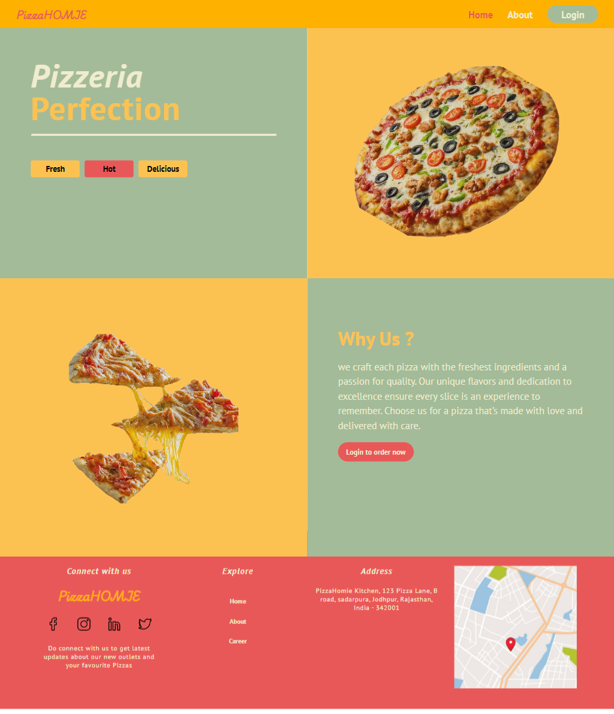
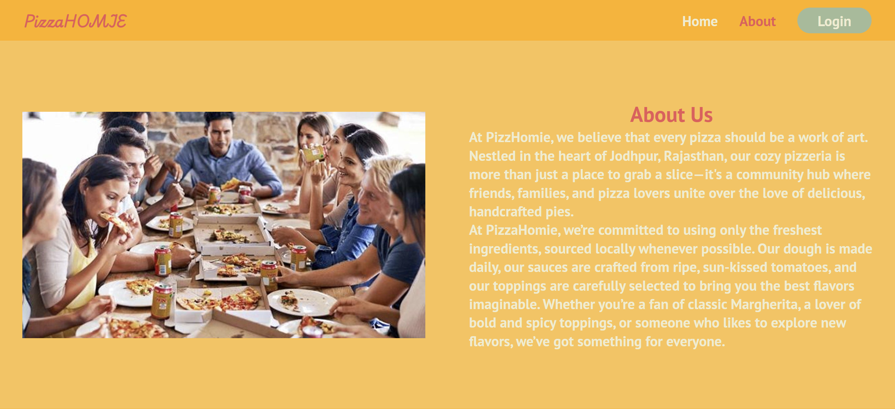
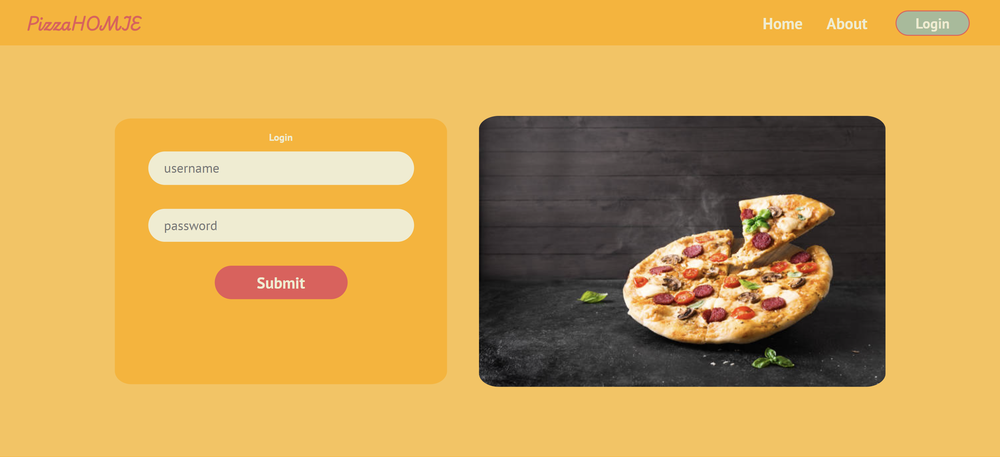
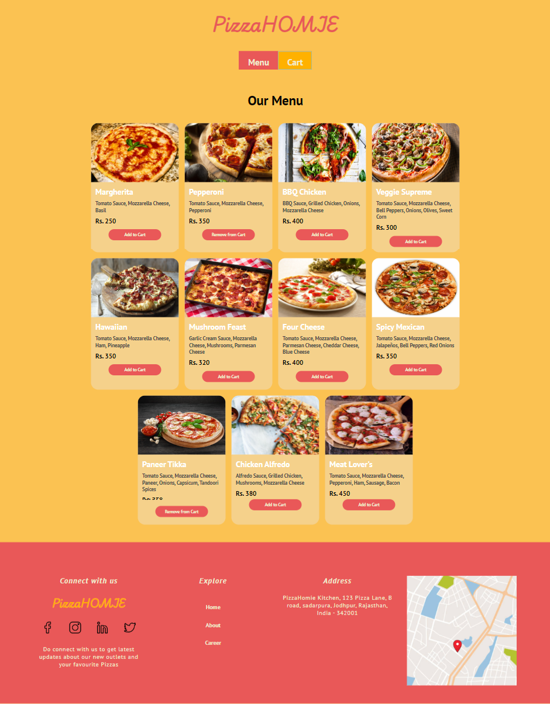
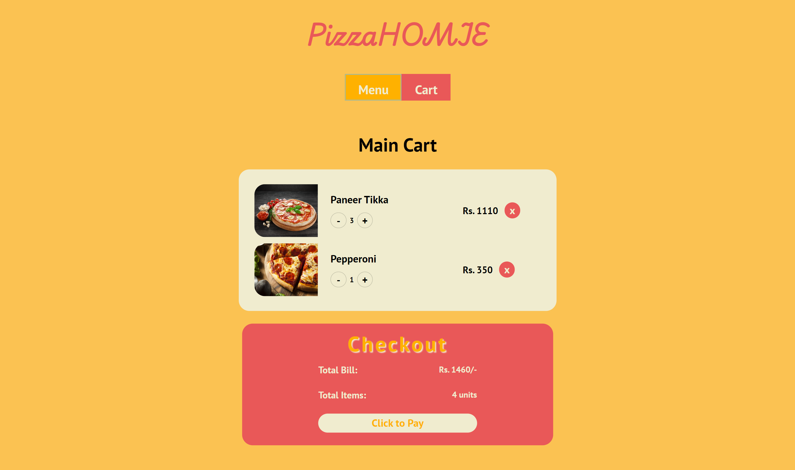

# PizzaHOMIE - Get Pizza of all categories

PizzaHOMIE is an pizza restaurant site, consist of an dynamic page and static landing page. The site is fully responsive and has dummy login. Site also has persistent data storage, thanks to localstorage API. The site data is coming from an JSON server which host data from "data.pizzas.json" file.
I am really proud of my project as it is my first project where I use react router, different hooks, and also built my own useLocalStorageState hook which literally save a lot of time in building and managing state.

One thing that I don't like about my this project is the way in which I handle css, I have define css of components in pages/styles css modules and then forward them to component from props. I did this cause initially I thought that this components are page specific so there is no sense of building their seperate css files but now, after completing project I realised doing this has made my project structure very confusing to understand. But from now I will take care of it in upcoming project.

## Live Site

[https://pizzahomie.netlify.app/](https://pizzahomie.netlify.app/)

## TechStack and Tools

- [Vite](https://vitejs.dev/): For creating devlopment enviroment with dev server and hot reloading.
- [React.js](https://react.dev/): For developing frontend
- [React Router](https://reactrouter.com/en/main): For creating dynamic routes
- [JSONSilo](https://jsonsilo.com/): For json server hosting, used it to create API endpoint.
- [Netlify](https://www.netlify.com/): For deployment with continous integration.

## Screenshots

### Home Page - Landing Page

### About Page

### Login Page

### Main App

### Cart Page

## Socials

- Gitanshu Sankhla

   
  
